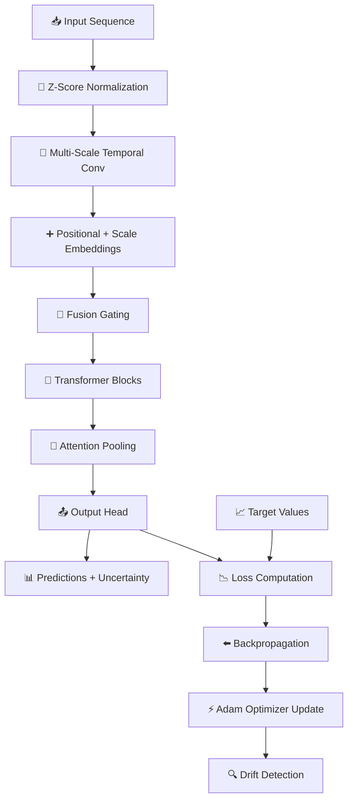

🚀 Multivariate FT-Transformer Regression

<div align="center">

**A Fusion Temporal Transformer for Multivariate Regression with Incremental
Online Learning**

[📦 JSR Package](https://jsr.io/@hviana/multivariate-ft-transformer-regression)
• [💻 GitHub](https://github.com/hviana/multivariate-ft-transformer-regression)
• [📖 Documentation](#-table-of-contents)

---

_Zero dependencies • Pure TypeScript • Online Learning • Production Ready_

</div>

---

## 📑 Table of Contents

- [✨ Features](#-features)
- [🏗️ Architecture Overview](#️-architecture-overview)
- [📦 Installation](#-installation)
- [🚀 Quick Start](#-quick-start)
- [🔧 Configuration](#-configuration)
- [📚 API Reference](#-api-reference)
- [🧠 Core Concepts](#-core-concepts)
- [⚡ Parameter Optimization Guide](#-parameter-optimization-guide)
- [📊 Use Cases](#-use-cases)
- [🔬 Mathematical Foundation](#-mathematical-foundation)
- [💾 Model Persistence](#-model-persistence)
- [📈 Performance Tips](#-performance-tips)
- [🤝 Contributing](#-contributing)
- [📄 License](#-license)

---

## ✨ Features

<table>
<tr>
<td width="50%">

### 🧠 **Core ML Features**

- 🔄 **Online Learning** - Train incrementally on streaming data
- 🎯 **Multi-scale Temporal Convolutions** - Capture patterns at different time
  scales
- 🔍 **Multi-head Self-Attention** - Learn complex temporal dependencies
- 📊 **Multivariate Support** - Handle multiple input/output dimensions
- 📉 **Uncertainty Estimation** - Confidence intervals for predictions

</td>
<td width="50%">

### ⚙️ **Advanced Capabilities**

- 🚀 **Adam Optimizer** with warmup & cosine decay
- 📈 **Welford's Algorithm** for online normalization
- 🛡️ **L2 Regularization** to prevent overfitting
- 🎚️ **Outlier Downweighting** for robust training
- 🔔 **ADWIN Drift Detection** for concept drift
- ⚖️ **Xavier Initialization** for stable training

</td>
</tr>
</table>

---

## 🏗️ Architecture Overview

```
┌─────────────────────────────────────────────────────────────────────────────┐
│                    FUSION TEMPORAL TRANSFORMER ARCHITECTURE                  │
└─────────────────────────────────────────────────────────────────────────────┘

                              ┌─────────────────┐
                              │   Input Data    │
                              │  [seq × input]  │
                              └────────┬────────┘
                                       │
                    ┌──────────────────┼──────────────────┐
                    │                  │                  │
                    ▼                  ▼                  ▼
         ┌──────────────────┐ ┌──────────────────┐ ┌──────────────────┐
         │ Temporal Conv    │ │ Temporal Conv    │ │ Temporal Conv    │
         │   Scale = 1      │ │   Scale = 2      │ │   Scale = 4      │
         │  ┌───────────┐   │ │  ┌───────────┐   │ │  ┌───────────┐   │
         │  │ 1D Conv   │   │ │  │ 1D Conv   │   │ │  │ 1D Conv   │   │
         │  │ + GELU    │   │ │  │ + GELU    │   │ │  │ + GELU    │   │
         │  └───────────┘   │ │  └───────────┘   │ │  └───────────┘   │
         └────────┬─────────┘ └────────┬─────────┘ └────────┬─────────┘
                  │                    │                    │
                  ▼                    ▼                    ▼
         ┌──────────────────┐ ┌──────────────────┐ ┌──────────────────┐
         │ + Scale Embed    │ │ + Scale Embed    │ │ + Scale Embed    │
         │ + Pos Encoding   │ │ + Pos Encoding   │ │ + Pos Encoding   │
         └────────┬─────────┘ └────────┬─────────┘ └────────┬─────────┘
                  │                    │                    │
                  └──────────────┬─────┴─────┬──────────────┘
                                 │ Upsample  │
                                 │ & Concat  │
                                 └─────┬─────┘
                                       │
                              ┌────────▼────────┐
                              │  Fusion Gate    │
                              │  (Sigmoid)      │
                              │  + Dropout      │
                              └────────┬────────┘
                                       │
                    ╔══════════════════╧══════════════════╗
                    ║     TRANSFORMER BLOCKS (×N)         ║
                    ╠═════════════════════════════════════╣
                    ║  ┌───────────────────────────────┐  ║
                    ║  │      Layer Norm 1             │  ║
                    ║  └───────────────┬───────────────┘  ║
                    ║                  │                  ║
                    ║  ┌───────────────▼───────────────┐  ║
                    ║  │   Multi-Head Self-Attention   │  ║
                    ║  │  ┌─────┬─────┬─────┬─────┐   │  ║
                    ║  │  │ Wq  │ Wk  │ Wv  │ Wo  │   │  ║
                    ║  │  └─────┴─────┴─────┴─────┘   │  ║
                    ║  │      Causal Masking          │  ║
                    ║  └───────────────┬───────────────┘  ║
                    ║                  │ + Residual       ║
                    ║  ┌───────────────▼───────────────┐  ║
                    ║  │      Layer Norm 2             │  ║
                    ║  └───────────────┬───────────────┘  ║
                    ║                  │                  ║
                    ║  ┌───────────────▼───────────────┐  ║
                    ║  │    Feed-Forward Network       │  ║
                    ║  │  Linear → GELU → Linear       │  ║
                    ║  └───────────────┬───────────────┘  ║
                    ║                  │ + Residual       ║
                    ╚══════════════════╧══════════════════╝
                                       │
                              ┌────────▼────────┐
                              │ Attention Pool  │
                              │ (Weighted Sum)  │
                              └────────┬────────┘
                                       │
                              ┌────────▼────────┐
                              │  Output Head    │
                              │  Linear Layer   │
                              └────────┬────────┘
                                       │
                              ┌────────▼────────┐
                              │   Predictions   │
                              │  [output_dim]   │
                              └─────────────────┘
```

### 📊 Data Flow Diagram



---

## 📦 Installation

### Deno / JSR

```typescript
import { ConvolutionalRegression } from "jsr:@hviana/multivariate-ft-transformer-regression";
```

### Import Map (deno.json)

```json
{
  "imports": {
    "@hviana/ft-transformer": "jsr:@hviana/multivariate-ft-transformer-regression"
  }
}
```

Then use:

```typescript
import { ConvolutionalRegression } from "@hviana/ft-transformer";
```

---

## 🚀 Quick Start

### Basic Example

```typescript
import { ConvolutionalRegression } from "jsr:@hviana/multivariate-ft-transformer-regression";

// 1️⃣ Create model with default configuration
const model = new ConvolutionalRegression();

// 2️⃣ Prepare training data (time series)
const trainingData = [
  {
    xCoordinates: [[1, 2], [3, 4], [5, 6], [7, 8]], // [seqLen][inputDim]
    yCoordinates: [[10], [20], [30], [40]], // [seqLen][outputDim]
  },
  // ... more samples
];

// 3️⃣ Train online (incremental learning)
for (const sample of trainingData) {
  const result = model.fitOnline(sample);

  console.log(`📊 Sample ${result.sampleIndex}:`);
  console.log(`   Loss: ${result.loss.toFixed(6)}`);
  console.log(`   Gradient Norm: ${result.gradientNorm.toFixed(6)}`);
  console.log(`   Learning Rate: ${result.effectiveLearningRate.toFixed(6)}`);
  console.log(`   Converged: ${result.converged ? "✅" : "❌"}`);
  console.log(`   Drift Detected: ${result.driftDetected ? "⚠️" : "✓"}`);
}

// 4️⃣ Make predictions
const predictions = model.predict(5); // Predict 5 future steps

for (let i = 0; i < predictions.predictions.length; i++) {
  const pred = predictions.predictions[i];
  console.log(`\n🔮 Step ${i + 1}:`);
  console.log(`   Predicted: ${pred.predicted.map((v) => v.toFixed(3))}`);
  console.log(
    `   95% CI: [${pred.lowerBound.map((v) => v.toFixed(3))}] - [${
      pred.upperBound.map((v) => v.toFixed(3))
    }]`,
  );
  console.log(`   Std Error: ${pred.standardError.map((v) => v.toFixed(3))}`);
}

// 5️⃣ Check model summary
const summary = model.getModelSummary();
console.log("\n📈 Model Summary:", summary);
```

### Custom Configuration Example

```typescript
const model = new ConvolutionalRegression({
  // Architecture
  numBlocks: 4, // More transformer blocks for complex patterns
  embeddingDim: 128, // Larger embeddings for more capacity
  numHeads: 8, // Must divide embeddingDim evenly
  ffnMultiplier: 4, // FFN hidden = 128 * 4 = 512

  // Temporal processing
  temporalScales: [1, 2, 4, 8], // Multi-scale analysis
  temporalKernelSize: 5, // Larger receptive field
  maxSequenceLength: 1024, // Longer sequences

  // Optimization
  learningRate: 0.0005, // Lower LR for stability
  warmupSteps: 200, // Longer warmup
  totalSteps: 50000, // Longer cosine decay

  // Regularization
  regularizationStrength: 1e-5, // Less regularization
  attentionDropout: 0.1, // Add dropout
  fusionDropout: 0.05, // Fusion dropout

  // Robustness
  outlierThreshold: 2.5, // More aggressive outlier detection
  adwinDelta: 0.001, // More sensitive drift detection
});
```

---

## 🔧 Configuration

### Complete Configuration Reference

```typescript
interface Config {
  // 🏗️ Architecture Parameters
  numBlocks: number; // Number of transformer blocks
  embeddingDim: number; // Embedding dimension (must be divisible by numHeads)
  numHeads: number; // Number of attention heads
  ffnMultiplier: number; // FFN hidden dimension = embeddingDim × ffnMultiplier

  // ⏱️ Temporal Processing
  temporalScales: number[]; // Multi-scale temporal convolution scales
  temporalKernelSize: number; // Convolution kernel size
  maxSequenceLength: number; // Maximum input sequence length

  // 🎛️ Regularization
  attentionDropout: number; // Dropout rate for attention weights
  fusionDropout: number; // Dropout rate for fusion gate
  regularizationStrength: number; // L2 regularization coefficient

  // ⚡ Optimization
  learningRate: number; // Base learning rate
  warmupSteps: number; // LR warmup steps
  totalSteps: number; // Total steps for LR schedule
  beta1: number; // Adam first moment decay
  beta2: number; // Adam second moment decay
  epsilon: number; // Adam numerical stability term

  // 🎯 Training Control
  convergenceThreshold: number; // Gradient norm convergence threshold
  outlierThreshold: number; // Z-score outlier threshold
  adwinDelta: number; // ADWIN drift detection sensitivity
}
```

### Default Configuration Values

```typescript
const DEFAULT_CONFIG = {
  // Architecture
  numBlocks: 3,
  embeddingDim: 64,
  numHeads: 8,
  ffnMultiplier: 4,

  // Temporal
  temporalScales: [1, 2, 4],
  temporalKernelSize: 3,
  maxSequenceLength: 512,

  // Regularization
  attentionDropout: 0.0,
  fusionDropout: 0.0,
  regularizationStrength: 1e-4,

  // Optimization
  learningRate: 0.001,
  warmupSteps: 100,
  totalSteps: 10000,
  beta1: 0.9,
  beta2: 0.999,
  epsilon: 1e-8,

  // Training Control
  convergenceThreshold: 1e-6,
  outlierThreshold: 3.0,
  adwinDelta: 0.002,
};
```

---

## 📚 API Reference

### Constructor

```typescript
constructor(config?: Partial<Config>)
```

Creates a new model instance. Configuration is lazily applied - actual
initialization occurs on first `fitOnline()` call.

**Example:**

```typescript
// Default configuration
const model1 = new ConvolutionalRegression();

// Custom configuration
const model2 = new ConvolutionalRegression({
  numBlocks: 4,
  embeddingDim: 128,
});
```

---

### fitOnline()

```typescript
fitOnline(data: { 
  xCoordinates: number[][]; 
  yCoordinates: number[][] 
}): FitResult
```

Trains the model on a single sample using online learning.

**Parameters:**

| Parameter      | Type         | Description                                                          |
| -------------- | ------------ | -------------------------------------------------------------------- |
| `xCoordinates` | `number[][]` | Input sequence `[seqLen][inputDim]`                                  |
| `yCoordinates` | `number[][]` | Output sequence `[seqLen][outputDim]` (uses last timestep as target) |

**Returns: `FitResult`**

```typescript
interface FitResult {
  loss: number; // Total loss (MSE + L2 regularization)
  gradientNorm: number; // L2 norm of all gradients
  effectiveLearningRate: number; // Current LR after warmup/decay
  isOutlier: boolean; // Was this sample detected as outlier?
  converged: boolean; // Has gradient norm reached threshold?
  sampleIndex: number; // Total samples processed
  driftDetected: boolean; // Was concept drift detected?
}
```

**Example:**

```typescript
const result = model.fitOnline({
  xCoordinates: [[1, 2, 3], [4, 5, 6], [7, 8, 9]],
  yCoordinates: [[10], [20], [30]],
});

if (result.driftDetected) {
  console.log("⚠️ Concept drift detected! Model adapting...");
}

if (result.converged) {
  console.log("✅ Model has converged!");
}
```

---

### predict()

```typescript
predict(futureSteps: number): PredictionResult
```

Generates predictions for future timesteps with uncertainty estimates.

**Parameters:**

| Parameter     | Type     | Description                       |
| ------------- | -------- | --------------------------------- |
| `futureSteps` | `number` | Number of future steps to predict |

**Returns: `PredictionResult`**

```typescript
interface PredictionResult {
  predictions: SinglePrediction[]; // Array of predictions
  accuracy: number; // Model accuracy estimate (0-1)
  sampleCount: number; // Training samples processed
  isModelReady: boolean; // Is model ready for prediction?
}

interface SinglePrediction {
  predicted: number[]; // Point predictions [outputDim]
  lowerBound: number[]; // 95% CI lower bound [outputDim]
  upperBound: number[]; // 95% CI upper bound [outputDim]
  standardError: number[]; // Standard error [outputDim]
}
```

**Example:**

```typescript
const result = model.predict(10);

if (!result.isModelReady) {
  console.log("⏳ Model needs more training data");
  return;
}

console.log(`📊 Model Accuracy: ${(result.accuracy * 100).toFixed(1)}%`);

result.predictions.forEach((pred, step) => {
  console.log(
    `Step ${step + 1}: ${pred.predicted[0].toFixed(2)} ± ${
      pred.standardError[0].toFixed(2)
    }`,
  );
});
```

---

### getModelSummary()

```typescript
getModelSummary(): ModelSummary
```

Returns comprehensive model statistics and configuration.

**Returns: `ModelSummary`**

```typescript
interface ModelSummary {
  isInitialized: boolean; // Has model been initialized?
  inputDimension: number; // Input feature dimension
  outputDimension: number; // Output dimension
  numBlocks: number; // Number of transformer blocks
  embeddingDim: number; // Embedding dimension
  numHeads: number; // Attention heads
  temporalScales: number[]; // Temporal convolution scales
  totalParameters: number; // Total trainable parameters
  sampleCount: number; // Training samples processed
  accuracy: number; // Current accuracy estimate
  converged: boolean; // Has model converged?
  effectiveLearningRate: number; // Current learning rate
  driftCount: number; // Number of drift events detected
}
```

**Example:**

```typescript
const summary = model.getModelSummary();

console.log(`
╔════════════════════════════════════════╗
║           MODEL SUMMARY                ║
╠════════════════════════════════════════╣
║ Architecture                           ║
║   • Input Dim:     ${
  summary.inputDimension.toString().padStart(5)
}              ║
║   • Output Dim:    ${
  summary.outputDimension.toString().padStart(5)
}              ║
║   • Blocks:        ${summary.numBlocks.toString().padStart(5)}              ║
║   • Embedding:     ${
  summary.embeddingDim.toString().padStart(5)
}              ║
║   • Heads:         ${summary.numHeads.toString().padStart(5)}              ║
║   • Parameters:    ${
  summary.totalParameters.toLocaleString().padStart(10)
}       ║
╠════════════════════════════════════════╣
║ Training Status                        ║
║   • Samples:       ${
  summary.sampleCount.toLocaleString().padStart(10)
}       ║
║   • Accuracy:      ${
  (summary.accuracy * 100).toFixed(1).padStart(5)
}%            ║
║   • Converged:     ${summary.converged ? "   ✅" : "   ❌"}              ║
║   • Drift Events:  ${summary.driftCount.toString().padStart(5)}              ║
╚════════════════════════════════════════╝
`);
```

---

### getWeights()

```typescript
getWeights(): WeightInfo
```

Returns all model weights for inspection or custom processing.

---

### getNormalizationStats()

```typescript
getNormalizationStats(): NormalizationStats
```

Returns the running normalization statistics.

```typescript
interface NormalizationStats {
  inputMean: number[]; // Running mean for each input feature
  inputStd: number[]; // Running std for each input feature
  outputMean: number[]; // Running mean for each output
  outputStd: number[]; // Running std for each output
  count: number; // Number of samples in statistics
}
```

---

### reset()

```typescript
reset(): void
```

Resets all model weights and statistics while preserving configuration.

**Example:**

```typescript
// Reset after detecting major drift
if (driftCount > 10) {
  console.log("🔄 Major drift detected, resetting model...");
  model.reset();
}
```

---

### save() / load()

```typescript
save(): string
load(state: string): void
```

Serialize/deserialize complete model state.

**Example:**

```typescript
// Save model
const modelState = model.save();
localStorage.setItem("model", modelState);

// Load model
const savedState = localStorage.getItem("model");
if (savedState) {
  model.load(savedState);
}
```

---

## 🧠 Core Concepts

### 1️⃣ Online Learning

Unlike traditional batch training, this model learns incrementally from each
sample:

```
┌─────────────────────────────────────────────────────────────┐
│                    ONLINE LEARNING FLOW                      │
├─────────────────────────────────────────────────────────────┤
│                                                              │
│   Sample 1 ──► Train ──► Update Weights ──► Ready           │
│                                    │                         │
│   Sample 2 ──► Train ──► Update Weights ──► Better          │
│                                    │                         │
│   Sample 3 ──► Train ──► Update Weights ──► Even Better     │
│                                    │                         │
│   Sample N ──► Train ──► Update Weights ──► Converged!      │
│                                                              │
└─────────────────────────────────────────────────────────────┘
```

**Benefits:**

- 💾 Memory efficient - no need to store entire dataset
- 🔄 Adapts to changing data distributions
- ⚡ Can start predicting immediately
- 📱 Suitable for edge devices

---

### 2️⃣ Multi-Scale Temporal Processing

The model processes input at multiple time scales simultaneously:

```
                      Input Sequence
                [t1, t2, t3, t4, t5, t6, t7, t8]
                             │
      ┌──────────────────────┼──────────────────────┐
      │                      │                      │
      ▼                      ▼                      ▼
┌───────────┐          ┌───────────┐          ┌───────────┐
│ Scale = 1 │          │ Scale = 2 │          │ Scale = 4 │
│ Full res  │          │ Half res  │          │ Quarter   │
└───────────┘          └───────────┘          └───────────┘
      │                      │                      │
      ▼                      ▼                      ▼
[8 timesteps]          [4 timesteps]          [2 timesteps]
      │                      │                      │
      └──────────────────────┼──────────────────────┘
                             │
                       Fusion Gate
                (learns optimal combination)
```

**Benefits:**

- 🔍 Captures short-term patterns (high-frequency)
- 📊 Captures long-term trends (low-frequency)
- 🎯 Adaptive weighting through fusion gate

---

### 3️⃣ Attention Mechanism

The transformer uses causal (masked) multi-head self-attention:

```
Query (Q)    Key (K)    Value (V)
   │            │           │
   └──────┬─────┘           │
          ▼                 │
    ┌───────────┐           │
    │  Q × K^T  │           │
    │  ───────  │           │
    │   √d_k    │           │
    └─────┬─────┘           │
          │                 │
          ▼                 │
    ┌───────────┐           │
    │  Softmax  │           │
    │  (causal) │           │
    └─────┬─────┘           │
          │                 │
          └────────┬────────┘
                   ▼
             ┌───────────┐
             │ Attention │
             │  × V      │
             └───────────┘
```

**Causal Mask Example (seq_len=4):**

```
     t1   t2   t3   t4
t1 [ ✓    ✗    ✗    ✗  ]   ← t1 only sees itself
t2 [ ✓    ✓    ✗    ✗  ]   ← t2 sees t1, t2
t3 [ ✓    ✓    ✓    ✗  ]   ← t3 sees t1, t2, t3
t4 [ ✓    ✓    ✓    ✓  ]   ← t4 sees all
```

---

### 4️⃣ Welford's Online Normalization

Instead of requiring the full dataset for normalization, we use Welford's
algorithm:

```typescript
// Standard approach (needs all data first):
mean = sum(x) / n
std = sqrt(sum((x - mean)²) / n)

// Welford's approach (updates incrementally):
// For each new sample x:
delta = x - mean
mean = mean + delta / n
M2 = M2 + delta × (x - mean)
std = sqrt(M2 / n)
```

**Update visualization:**

```
Sample 1: mean=10,    std=0
                 ↓
Sample 2: mean=15,    std=5
                 ↓
Sample 3: mean=13.3,  std=4.7
                 ↓
Sample N: mean→μ,     std→σ  (converges to true values)
```

---

### 5️⃣ ADWIN Drift Detection

**A**daptive **WIN**dowing algorithm detects when data distribution changes:

```
┌─────────────────────────────────────────────────────────────┐
│                    ADWIN DRIFT DETECTION                     │
├─────────────────────────────────────────────────────────────┤
│                                                              │
│   Sliding Window of Losses:                                  │
│                                                              │
│   [0.5, 0.4, 0.3, 0.3, 0.2, │ 0.8, 0.9, 1.0, 1.1, 1.2]     │
│            ↑                        ↑                        │
│       Window 1                 Window 2                      │
│       (mean: 0.34)            (mean: 1.0)                    │
│                                                              │
│   Statistical test: |0.34 - 1.0| > ε ?                      │
│   If yes → DRIFT DETECTED! 🔔                               │
│                                                              │
└─────────────────────────────────────────────────────────────┘
```

---

### 6️⃣ Learning Rate Schedule

The optimizer uses warmup followed by cosine decay:

```
Learning
  Rate
    │
  lr│            ╭─────╮
    │          ╱         ╲
    │        ╱             ╲
    │      ╱                 ╲
    │    ╱                     ╲
    │  ╱  Warmup    Cosine      ╲
    │╱                  Decay     ╲
    └────────────────────────────────► Steps
    0    warmup         total
         steps          steps
```

**Formula:**

```
if step < warmup:
    lr = base_lr × (step + 1) / warmup
else:
    progress = (step - warmup) / (total - warmup)
    lr = base_lr × 0.5 × (1 + cos(π × progress))
```

---

## ⚡ Parameter Optimization Guide

### 📋 Quick Reference Table

| Use Case             | Recommended Settings                                          |
| -------------------- | ------------------------------------------------------------- |
| **Fast Prototyping** | `numBlocks: 2`, `embeddingDim: 32`, `learningRate: 0.001`     |
| **Standard Usage**   | `numBlocks: 3`, `embeddingDim: 64`, `learningRate: 0.001`     |
| **Complex Patterns** | `numBlocks: 4-6`, `embeddingDim: 128`, `learningRate: 0.0005` |
| **Noisy Data**       | `outlierThreshold: 2.0`, `regularizationStrength: 1e-3`       |
| **Streaming Data**   | `adwinDelta: 0.001`, `warmupSteps: 50`                        |
| **Long Sequences**   | `maxSequenceLength: 1024`, `temporalScales: [1,2,4,8,16]`     |

---

### 🏗️ Architecture Parameters

#### `numBlocks` - Transformer Depth

| Value | Use Case                        | Trade-off                   |
| ----- | ------------------------------- | --------------------------- |
| 1-2   | Simple patterns, fast inference | Lower capacity              |
| 3-4   | **Standard choice**             | Good balance                |
| 5-8   | Complex temporal dependencies   | Slower, risk of overfitting |

```typescript
// Simple linear trends
const simple = new ConvolutionalRegression({ numBlocks: 2 });

// Complex seasonal + trend patterns
const complex = new ConvolutionalRegression({ numBlocks: 5 });
```

#### `embeddingDim` - Model Capacity

| Value | Use Case                   | Memory |
| ----- | -------------------------- | ------ |
| 32    | Low-dimensional data, fast | ~50KB  |
| 64    | **Standard choice**        | ~200KB |
| 128   | High-dimensional, complex  | ~800KB |
| 256+  | Very complex patterns      | 3MB+   |

> ⚠️ **Must be divisible by `numHeads`**

```typescript
// Memory-constrained environment
const lightweight = new ConvolutionalRegression({
  embeddingDim: 32,
  numHeads: 4, // 32/4 = 8 per head ✓
});

// High-capacity model
const highCapacity = new ConvolutionalRegression({
  embeddingDim: 256,
  numHeads: 8, // 256/8 = 32 per head ✓
});
```

#### `numHeads` - Attention Heads

| Value | Benefit            | Consideration                |
| ----- | ------------------ | ---------------------------- |
| 4     | Faster computation | Less pattern diversity       |
| 8     | **Good balance**   | Standard choice              |
| 16    | More pattern types | Requires larger embeddingDim |

```typescript
// Each head captures different patterns:
// Head 1: Short-term momentum
// Head 2: Long-term trends
// Head 3: Periodic patterns
// Head 4: Outlier detection
// etc.
```

#### `ffnMultiplier` - FFN Hidden Size

| Value | FFN Size (if emb=64) | Use Case      |
| ----- | -------------------- | ------------- |
| 2     | 128                  | Lightweight   |
| 4     | 256                  | **Standard**  |
| 8     | 512                  | High capacity |

---

### ⏱️ Temporal Parameters

#### `temporalScales` - Multi-Scale Analysis

```typescript
// Short-term prediction (minutes/hours)
const shortTerm = new ConvolutionalRegression({
  temporalScales: [1, 2, 3], // Fine-grained
});

// Medium-term (hours/days)
const mediumTerm = new ConvolutionalRegression({
  temporalScales: [1, 2, 4, 8], // Mixed
});

// Long-term (days/weeks)
const longTerm = new ConvolutionalRegression({
  temporalScales: [1, 4, 16, 64], // Coarse-grained
});

// Multi-resolution (all patterns)
const multiRes = new ConvolutionalRegression({
  temporalScales: [1, 2, 4, 8, 16, 32],
});
```

**Visualization:**

```
Input: [────────────────────────────────]
         32 timesteps

Scale 1: [································]  32 points (all details)
Scale 2: [················]                  16 points (smoothed)
Scale 4: [········]                           8 points (trends)
Scale 8: [····]                               4 points (major patterns)
```

#### `temporalKernelSize` - Convolution Window

| Value | Receptive Field | Best For               |
| ----- | --------------- | ---------------------- |
| 3     | Small           | Point-to-point changes |
| 5     | Medium          | **General purpose**    |
| 7+    | Large           | Smooth patterns        |

```typescript
// Sharp transitions (e.g., events)
const sharp = new ConvolutionalRegression({ temporalKernelSize: 3 });

// Smooth trends (e.g., weather)
const smooth = new ConvolutionalRegression({ temporalKernelSize: 7 });
```

---

### ⚡ Optimization Parameters

#### `learningRate` - Training Speed

| Value  | Stability | Convergence             |
| ------ | --------- | ----------------------- |
| 0.01   | Low       | Very fast (may diverge) |
| 0.001  | **Good**  | **Standard**            |
| 0.0001 | High      | Slow (fine-tuning)      |

```typescript
// Initial training
const initial = new ConvolutionalRegression({ learningRate: 0.001 });

// Fine-tuning after drift
const fineTune = new ConvolutionalRegression({ learningRate: 0.0001 });
```

#### `warmupSteps` + `totalSteps` - LR Schedule

```typescript
// Quick adaptation needed
const quick = new ConvolutionalRegression({
  warmupSteps: 50,
  totalSteps: 5000,
});

// Stable long-term training
const stable = new ConvolutionalRegression({
  warmupSteps: 500,
  totalSteps: 100000,
});

// Guideline: warmupSteps ≈ 5-10% of totalSteps
```

---

### 🛡️ Regularization Parameters

#### `regularizationStrength` - L2 Penalty

| Value | Effect            | Use Case                 |
| ----- | ----------------- | ------------------------ |
| 0     | No regularization | Clean data, underfitting |
| 1e-5  | Light             | Large datasets           |
| 1e-4  | **Standard**      | Most cases               |
| 1e-3  | Strong            | Small/noisy datasets     |
| 1e-2  | Very strong       | Extreme overfitting      |

```typescript
// Lots of clean data
const clean = new ConvolutionalRegression({
  regularizationStrength: 1e-5,
});

// Limited noisy data
const noisy = new ConvolutionalRegression({
  regularizationStrength: 1e-3,
});
```

#### `attentionDropout` + `fusionDropout`

| Value   | Effect                     |
| ------- | -------------------------- |
| 0.0     | No dropout (deterministic) |
| 0.1     | Light regularization       |
| 0.2-0.3 | Moderate (for overfitting) |
| 0.5+    | Heavy (rarely needed)      |

```typescript
// Prevent overfitting on small datasets
const regularized = new ConvolutionalRegression({
  attentionDropout: 0.1,
  fusionDropout: 0.05,
});
```

---

### 🎯 Training Control Parameters

#### `outlierThreshold` - Outlier Detection

Based on z-score (standard deviations from mean):

| Value | Outlier % (normal dist) | Use Case             |
| ----- | ----------------------- | -------------------- |
| 2.0   | 4.55%                   | Aggressive filtering |
| 2.5   | 1.24%                   | Moderate             |
| 3.0   | 0.27%                   | **Standard**         |
| 4.0   | 0.006%                  | Almost none filtered |

```typescript
// Financial data (many outliers)
const financial = new ConvolutionalRegression({
  outlierThreshold: 2.0, // Downweight extreme values
});

// Sensor data (few outliers)
const sensor = new ConvolutionalRegression({
  outlierThreshold: 4.0, // Only extreme outliers
});
```

#### `adwinDelta` - Drift Sensitivity

| Value | Sensitivity  | False Positive Rate |
| ----- | ------------ | ------------------- |
| 0.001 | Very high    | More false alarms   |
| 0.002 | **Standard** | Balanced            |
| 0.01  | Low          | May miss drift      |
| 0.1   | Very low     | Only major changes  |

```typescript
// Rapidly changing environment
const dynamic = new ConvolutionalRegression({
  adwinDelta: 0.001,
});

// Stable environment
const stable = new ConvolutionalRegression({
  adwinDelta: 0.01,
});
```

---

### 💡 Configuration Recipes

#### 🌡️ Weather Prediction

```typescript
const weatherModel = new ConvolutionalRegression({
  numBlocks: 3,
  embeddingDim: 64,
  numHeads: 8,
  temporalScales: [1, 6, 24, 168], // hourly, 6h, daily, weekly
  temporalKernelSize: 5,
  maxSequenceLength: 720, // 30 days of hourly data
  learningRate: 0.0005,
  warmupSteps: 200,
  outlierThreshold: 3.0, // Weather can be extreme
  regularizationStrength: 1e-4,
});
```

#### 📈 Stock Price Prediction

```typescript
const stockModel = new ConvolutionalRegression({
  numBlocks: 4,
  embeddingDim: 128,
  numHeads: 8,
  temporalScales: [1, 2, 5, 20], // tick, minutes, hours, days
  temporalKernelSize: 3, // Sharp movements
  maxSequenceLength: 512,
  learningRate: 0.0001, // Very careful updates
  warmupSteps: 500,
  outlierThreshold: 2.5, // Financial outliers common
  adwinDelta: 0.001, // Markets change fast
  regularizationStrength: 1e-3,
  attentionDropout: 0.1,
});
```

#### 🏭 Industrial Sensor Monitoring

```typescript
const sensorModel = new ConvolutionalRegression({
  numBlocks: 2, // Real-time requirements
  embeddingDim: 32, // Lightweight
  numHeads: 4,
  temporalScales: [1, 5, 30], // seconds, minutes
  temporalKernelSize: 5,
  maxSequenceLength: 360, // 1 hour at 10s intervals
  learningRate: 0.001,
  warmupSteps: 50,
  outlierThreshold: 4.0, // Sensors are reliable
  adwinDelta: 0.002, // Detect equipment degradation
  regularizationStrength: 1e-5,
});
```

#### 🛒 E-commerce Demand Forecasting

```typescript
const demandModel = new ConvolutionalRegression({
  numBlocks: 4,
  embeddingDim: 128,
  numHeads: 8,
  temporalScales: [1, 7, 30, 90], // daily, weekly, monthly, quarterly
  temporalKernelSize: 7, // Smooth demand patterns
  maxSequenceLength: 365, // 1 year history
  learningRate: 0.0005,
  warmupSteps: 100,
  outlierThreshold: 2.5, // Promotions cause spikes
  adwinDelta: 0.005, // Seasonal drift expected
  regularizationStrength: 1e-4,
});
```

---

## 📊 Use Cases

### Time Series Forecasting

```typescript
// Multi-step ahead forecasting
const model = new ConvolutionalRegression({ numBlocks: 4 });

// Train on historical data
historicalData.forEach((window) => {
  model.fitOnline({
    xCoordinates: window.features, // [seq][features]
    yCoordinates: window.targets, // [seq][1]
  });
});

// Predict next 24 hours
const forecast = model.predict(24);
```

### Anomaly Detection

```typescript
// Train model to predict normal behavior
const model = new ConvolutionalRegression({
  outlierThreshold: 2.0, // Lower threshold
});

// Check if new data is anomalous
function detectAnomaly(newData) {
  const result = model.fitOnline(newData);
  return result.isOutlier; // True if anomalous
}
```

### Streaming Data Analysis

```typescript
// Real-time processing
const model = new ConvolutionalRegression({
  adwinDelta: 0.001, // Sensitive to changes
  warmupSteps: 50, // Quick adaptation
});

// Process stream
for await (const data of dataStream) {
  const result = model.fitOnline(data);

  if (result.driftDetected) {
    notifyOperators("Distribution change detected!");
  }

  // Always-fresh predictions
  const predictions = model.predict(1);
  displayDashboard(predictions);
}
```

---

## 🔬 Mathematical Foundation

### Loss Function

```
L = L_MSE + λ × L_reg

L_MSE = (1/2n) × Σᵢ (ŷᵢ - yᵢ)²

L_reg = (λ/2) × Σ_w w²
```

### Adam Optimizer

```
m_t = β₁ × m_{t-1} + (1 - β₁) × g_t
v_t = β₂ × v_{t-1} + (1 - β₂) × g_t²

m̂_t = m_t / (1 - β₁^t)
v̂_t = v_t / (1 - β₂^t)

θ_t = θ_{t-1} - lr × m̂_t / (√v̂_t + ε)
```

### GELU Activation

```
GELU(x) = x × Φ(x)
        ≈ 0.5x × (1 + tanh(√(2/π) × (x + 0.044715x³)))
```

### Xavier Initialization

```
W ~ U(-limit, limit)
limit = √(6 / (fan_in + fan_out))
```

### Attention

```
Attention(Q, K, V) = softmax(QK^T / √d_k) × V
```

---

## 💾 Model Persistence

### Save and Load

```typescript
// Save model state
const model = new ConvolutionalRegression();
// ... train model ...

const state = model.save();
await Deno.writeTextFile("model.json", state);

// Load model state
const loaded = await Deno.readTextFile("model.json");
const restoredModel = new ConvolutionalRegression();
restoredModel.load(loaded);

// Continue training or predicting
const predictions = restoredModel.predict(5);
```

### Checkpointing Strategy

```typescript
let bestAccuracy = 0;
let bestModelState = "";

for (const batch of trainingData) {
  const result = model.fitOnline(batch);

  // Save best model
  const summary = model.getModelSummary();
  if (summary.accuracy > bestAccuracy) {
    bestAccuracy = summary.accuracy;
    bestModelState = model.save();
    console.log(
      `💾 New best model saved (accuracy: ${bestAccuracy.toFixed(4)})`,
    );
  }

  // Periodic checkpoint
  if (result.sampleIndex % 1000 === 0) {
    await Deno.writeTextFile(
      `checkpoint_${result.sampleIndex}.json`,
      model.save(),
    );
  }
}

// Restore best model for deployment
model.load(bestModelState);
```

---

## 📈 Performance Tips

### 🚀 Speed Optimization

```typescript
// 1. Use smaller architecture for real-time
const fastModel = new ConvolutionalRegression({
  numBlocks: 2,
  embeddingDim: 32,
  temporalScales: [1, 2],
});

// 2. Limit sequence length
const efficient = new ConvolutionalRegression({
  maxSequenceLength: 128, // Only recent history
});

// 3. Reduce temporal scales
const minimal = new ConvolutionalRegression({
  temporalScales: [1, 4], // Just two scales
});
```

### 💾 Memory Optimization

```typescript
// Estimate memory usage
const summary = model.getModelSummary();
const estimatedMB = (summary.totalParameters * 8 * 3) / 1_000_000;
// *8 for Float64, *3 for weights + adam_m + adam_v
console.log(`Estimated memory: ${estimatedMB.toFixed(1)} MB`);

// Low-memory configuration
const lowMem = new ConvolutionalRegression({
  embeddingDim: 32,
  numBlocks: 2,
  maxSequenceLength: 64,
});
```

### 📊 Accuracy Optimization

```typescript
// High-accuracy configuration
const accurate = new ConvolutionalRegression({
  numBlocks: 5,
  embeddingDim: 128,
  numHeads: 8,
  ffnMultiplier: 4,
  temporalScales: [1, 2, 4, 8, 16],
  learningRate: 0.0005,
  warmupSteps: 500,
  regularizationStrength: 1e-4,
  attentionDropout: 0.1,
});
```

---

## 🔄 Training Loop Best Practices

```typescript
async function trainModel(model: ConvolutionalRegression, data: DataStream) {
  let patience = 0;
  const maxPatience = 100;
  let bestLoss = Infinity;

  for await (const sample of data) {
    const result = model.fitOnline(sample);

    // Early stopping
    if (result.loss < bestLoss) {
      bestLoss = result.loss;
      patience = 0;
    } else {
      patience++;
      if (patience >= maxPatience) {
        console.log("⏹️ Early stopping triggered");
        break;
      }
    }

    // Handle drift
    if (result.driftDetected) {
      console.log("🔄 Drift detected, adapting...");
      // Optionally reset or adjust learning rate
    }

    // Convergence check
    if (result.converged) {
      console.log("✅ Model converged!");
      break;
    }

    // Progress logging
    if (result.sampleIndex % 100 === 0) {
      console.log(
        `📊 Step ${result.sampleIndex}: loss=${result.loss.toFixed(6)}, lr=${
          result.effectiveLearningRate.toFixed(6)
        }`,
      );
    }
  }

  return model;
}
```

---

## 🤝 Contributing

Contributions are welcome! Please feel free to submit issues and pull requests
on [GitHub](https://github.com/hviana/multivariate-ft-transformer-regression).

### Development Setup

```bash
# Clone repository
git clone https://github.com/hviana/multivariate-ft-transformer-regression.git

# Run tests
deno test

# Run examples
deno run --allow-read examples/basic.ts
```

---

## 📄 License

MIT License © 2025 [Henrique Emanoel Viana](https://github.com/hviana)

```
Permission is hereby granted, free of charge, to any person obtaining a copy
of this software and associated documentation files (the "Software"), to deal
in the Software without restriction, including without limitation the rights
to use, copy, modify, merge, publish, distribute, sublicense, and/or sell
copies of the Software, and to permit persons to whom the Software is
furnished to do so, subject to the following conditions:

The above copyright notice and this permission notice shall be included in all
copies or substantial portions of the Software.

THE SOFTWARE IS PROVIDED "AS IS", WITHOUT WARRANTY OF ANY KIND, EXPRESS OR
IMPLIED, INCLUDING BUT NOT LIMITED TO THE WARRANTIES OF MERCHANTABILITY,
FITNESS FOR A PARTICULAR PURPOSE AND NONINFRINGEMENT.
```

---

<div align="center">

**Made with ❤️ by [Henrique Emanoel Viana](https://github.com/hviana)**

⭐ Star this repo if you find it useful!

[Report Bug](https://github.com/hviana/multivariate-ft-transformer-regression/issues)
•
[Request Feature](https://github.com/hviana/multivariate-ft-transformer-regression/issues)

</div>
